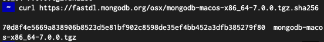
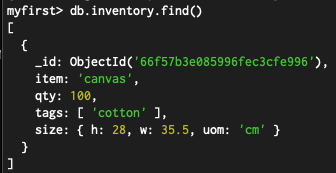
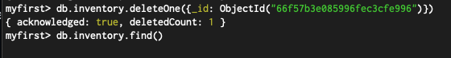

### Screenshots

#### Verification

#### CRUD

_insert_

_query_

_update_

_delete_

Nothing is found above as its deleted.

#### Experiment 2

_Reasoning_
The map-reduce function is useful in this situation because it efficiently processes and aggregates data across multiple documents to calculate the total price per customer in the `orders` collection. Specifically, the `map` function emits each `cust_id` along with its `price`, and the `reduce` function then sums up these prices for each unique `cust_id`. This process is particularly effective when dealing with large datasets, as map-reduce is designed to handle parallel processing and aggregation tasks across many documents, making it ideal for computing summarized results in MongoDB.
It is still worth noting that this method is deprecated which you can also see in the output in the screenshot: _DeprecationWarning: Collection.mapReduce() is deprecated. Use an aggregation instead._

##### Pending issues

Currently no pending issues
